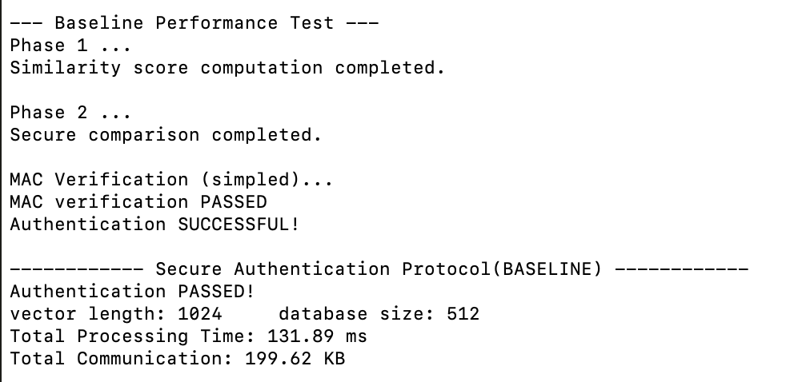
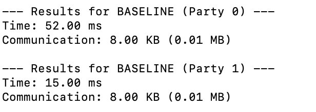
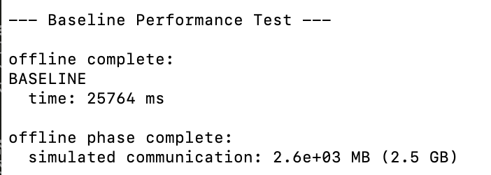
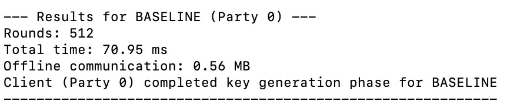
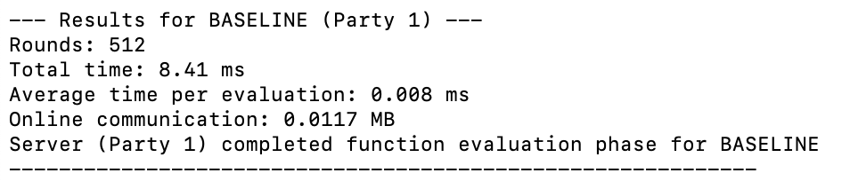

# BioAuth

FLAME: Flexible and Lightweight Biometric Authentication Scheme in Malicious Environments

## Quick Start

### Using Docker (Recommended)

Run the complete authentication process:
```bash
./RUN.sh
```

Run specific experiments:
```bash
./RUN.sh -e secure-authentication    # Complete authentication process (default)
./RUN.sh -e dot-product-db          # Dot product 
./RUN.sh -e dot-product-db-offline   # Dot product database simulated offline 
./RUN.sh -e secure-com               # Secure comparison 
```

**Requirements:** Docker environment

## Network Testing
All experiments test performance under 4 different network conditions:
- **BASELINE**: No network simulation (optimal performance)
- **LAN**: 0.1ms latency, 1Gbps bandwidth
- **MAN**: 6ms latency, 100Mbps bandwidth  
- **WAN**: 80ms latency, 40Mbps bandwidth

## Expected Output

### Secure Authentication (Vector Length: 1024,Database Size: 512)
| Network | Party 0/1 Time (ms) | Communication (KB) |
|---------|---------------------|--------------------|
| BASELINE| 131.89              | 199.62             |
| LAN     | 295.98              | 199.62             |
| MAN     | 856.51              | 199.62             |
| WAN     | 2922.81             | 199.62             |



### Secure Dot Product Online (Vector Length: 1024,Database Size: 512)
| Network | Party 0(Clent) Time (ms) | Party 1(Dataset) Time (ms) |  Communication (MB)|
|---------|--------------------------|----------------------------|--------------------|
| BASELINE| 52.00                    | 15.00                      | 0.01               |
| LAN     | 177.00                   | 154.00                     | 0.01               |
| MAN     | 776.00                   | 1006.00                    | 0.01               |
| WAN     | 2851.00                  | 3599.00                    | 0.01               |


### Secure Dot Product Simulated Offline (Vector Length: 1024,Database Size: 256)
 *Note: Simulated offline phase involves computationally intensive preprocessing with high communication overhead.*
| Network | Party 0+1 Time (mins) | Communication (GB)|
|---------|-----------------------|-------------------|
| BASELINE| 0.42                  | 2.5               |
| LAN     | 1.12                  | 2.5               |
| MAN     | 8.98                  | 2.5               |
| WAN     | 15.75                 | 2.5               |


### Secure Comparison (Rounds: 512)
| Network | Offline (Party 0) Time (ms) | Communication (MB) | Online (Party1) Time (ms) | Communication (MB) |
|---------|----------------------------|--------------------|----------------------------|--------------------|
| BASELINE| 70.95                      | 0.56               | 8.41                       | 0.0117             |
| LAN     | 82.84                      | 0.56               | 19.33                      | 0.0117             |
| MAN     | 84.37                      | 0.56               | 19.95                      | 0.0117             |
| WAN     | 89.52                      | 0.56               | 20.65                      | 0.0117             |




*Note: Performance may vary based on system specifications and network conditions.*

---

### Dependencies

The code has been tested on macOS 15.3. Building the code requires the following dependencies:

- A C++20 (GCC 10+,Clang 12+)
- CMake (3.12+)
- The Boost Library (1.70.0 or later)
- The Eigen Library (3.0 or later)
- OpenSSL
- GMP
- GMPXX
- pthread


##### on macOS
```shell
brew install cmake eigen boost openssl gmp
```
```

#### on Ubuntu
```shell
sudo apt-get update
sudo apt-get install build-essential cmake
sudo apt-get install libeigen3-dev libboost-dev
sudo apt-get install libssl-dev libgmp-dev libgmpxx4ldbl
sudo apt-get install libpthread-stubs0-dev
```

### Building the Project


```shell
git clone https://github.com/sakurasfy/BioAuth.git
cd BioAuth
mkdir -p build
cd build
cmake ..
make -j
```


### Running Experiments
1. Secure Inner Product for Database

set vector length=1024 and dbsize =512 in experiments/dot-product-db/dot_product_db_configure.h

```shell
cd build/experiments/dot-product-db

# offline
sudo ./dot_product_db_offline_party_0
sudo ./dot_product_db_offline_party_1

# online
sudo ./dot_product_db_party_0
sudo ./dot_product_db_party_1

```
2. Secure Comparison

set DEFAULT_ROUNDS=256 in experiments/secure-com/com_config.h

```shell
cd build/experiments/secure-com

# offline + online
sudo ./com_party_0
sudo ./com_party_1

```

3. Secure Authentication

set vector length=1024 and dbsize =512 in experiments/secure_authentication/secure_authentication_config.h


```shell
cd build/experiments/secure-authentication

# offline + online
sudo ./secure_authentication_party_0
sudo ./secure_authentication_party_1


## ⚠️ Important Notes

### Network Simulation Requirements

sudo privileges are required for network traffic control (tc commands)
Network simulation modifies system network settings temporarily
Experiments automatically clean up network configurations after completion
